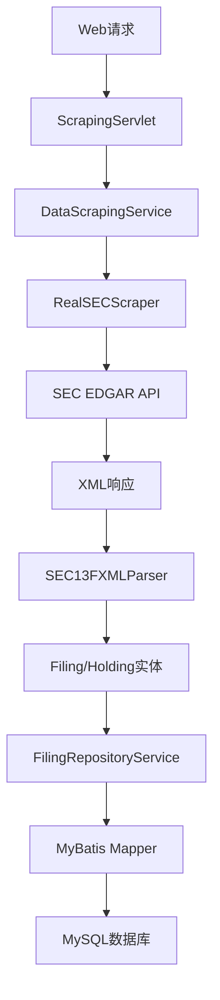
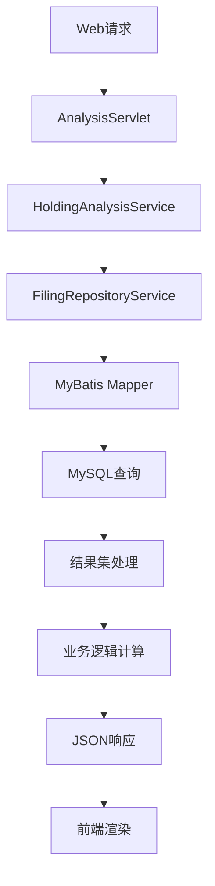

# 系统架构设计

## 🏗️ 整体架构

SEC 13F Parser采用现代化的分层架构和多模块设计，确保系统的可扩展性、可维护性和高性能。

### 架构原则
- **分层设计**: 表示层、业务逻辑层、数据访问层清晰分离
- **模块化**: 核心业务逻辑与持久化层分离，便于维护和扩展
- **松耦合**: 通过接口和依赖注入实现组件间的松耦合
- **高内聚**: 每个模块职责单一明确

## 📦 模块结构

### 多模块Maven架构

```
sec-13f-parser/                    # 主应用模块
├── src/main/java/com/company/sec13f/parser/
│   ├── web/                       # 表示层 (Servlet)
│   ├── service/                   # 业务逻辑层
│   ├── scraper/                   # 数据爬取引擎
│   ├── parser/                    # 数据解析器
│   ├── config/                    # 配置管理
│   └── WebServer.java             # 应用入口
└── src/main/resources/webapp/     # 前端资源

sec-data-collector-repository/     # 持久化模块 (新架构)
├── src/main/java/com/company/sec13f/repository/
│   ├── entity/                    # 实体类
│   ├── mapper/                    # MyBatis Mapper
│   ├── service/                   # 仓储服务层
│   └── MyBatisSessionFactory.java # 数据库会话工厂
└── src/main/resources/
    ├── mapper/                    # MyBatis XML映射
    └── mybatis-config.xml         # MyBatis配置
```

## 🔧 技术栈

### 后端技术栈
| 技术组件                  | 版本 | 用途 |
|-----------------------|--|-----|
| **Java**              | 8+ | 核心开发语言 |
| **Maven**             | 3.6+ | 项目构建和依赖管理 |
| **Jetty**             | 9.4.51 | 嵌入式Web服务器 |
| **MySQL**             | 8+ | 轻量级数据库 |
| **MyBatis**           | 3.5.13 | ORM框架 |
| **Spring**            | 5.3.27 | 依赖注入和事务管理 |
| **Jackson**           | 2.15.2 | JSON序列化/反序列化 |
| **Apache HttpClient** | 4.5.13 | HTTP客户端 |
| **JAXB**              | 2.3.1 | XML解析 |

### 前端技术栈
- **HTML5/CSS3**: 现代化页面结构和样式
- **JavaScript (ES6+)**: 交互逻辑和AJAX通信
- **响应式设计**: 支持多种屏幕尺寸
- **实时更新**: WebSocket或轮询实现进度监控

## 🏛️ 分层架构详解

### 1. 表示层 (Web Layer)

**位置**: `src/main/java/com/company/sec13f/parser/web/`

**职责**: 处理HTTP请求，提供RESTful API和Web界面

**核心组件**:
```java
// Web服务器入口
WebServer.java                    // Jetty服务器配置和启动

// Servlet控制器
AnalysisServlet.java             // 投资分析API (/api/analysis/*)
ScrapingServlet.java             // 数据爬取API (/api/scraping/*)  
SearchServlet.java               // 基础搜索API (/search)
TaskManagementServlet.java       // 任务管理API (/tasks/*)
SchedulingServlet.java           // 定时任务API (/api/scheduling/*)
HomeServlet.java                 // 主页和静态资源
```

**特性**:
- RESTful API设计
- JSON响应格式
- 错误处理和状态码管理
- 静态资源服务

### 2. 业务逻辑层 (Service Layer)

**位置**: `src/main/java/com/company/sec13f/parser/service/`

**职责**: 核心业务逻辑处理和流程编排

**核心组件**:
```java
// 核心分析服务
HoldingAnalysisService.java      // 持仓分析和计算
FilingService.java               // 文件处理服务

// 数据采集服务
DataScrapingService.java         // 数据爬取任务管理
ScheduledScrapingService.java    // 定时任务调度

// Spring集成
ApplicationConfig.java           // Spring配置
SchedulingConfig.java            // 调度配置
```

**特性**:
- 事务管理
- 异步处理 (CompletableFuture)
- Spring注解驱动
- 重试机制 (Spring Retry)

### 3. 数据访问层 (Repository Layer) - 新架构

**位置**: `sec-data-collector-repository/src/main/java/com/company/sec13f/repository/`

**职责**: 数据持久化和数据库交互

**实体层**:
```java
// JPA风格实体类
Filing.java                      // 13F文件实体
Holding.java                     // 持仓记录实体
ScrapingTask.java               // 任务实体
```

**数据访问层**:
```java
// MyBatis Mapper接口
FilingMapper.java               // 文件数据访问
HoldingMapper.java              // 持仓数据访问
ScrapingTaskMapper.java         // 任务数据访问
```

**服务层**:
```java
// Repository服务
FilingRepositoryService.java     // 文件仓储服务
ScrapingTaskRepositoryService.java // 任务仓储服务

// 会话管理
MyBatisSessionFactory.java       // 数据库会话工厂
```

**特性**:
- MyBatis ORM映射
- 类型安全的数据操作
- 连接池管理
- 事务支持
- 批量操作优化

### 4. 数据爬取层 (Scraper Layer)

**位置**: `src/main/java/com/company/sec13f/parser/scraper/`

**职责**: SEC数据获取和处理

**核心组件**:
```java
RealSECScraper.java             // SEC官方API客户端
EnhancedSECScraper.java         // 增强版爬取器（重试、限流）
SECScraper.java                 // 基础爬取器接口
```

**特性**:
- HTTP连接池
- 速率限制 (100ms间隔)
- 自动重试机制
- User-Agent管理
- 错误处理和日志

### 5. 数据解析层 (Parser Layer)

**位置**: `src/main/java/com/company/sec13f/parser/parser/`

**职责**: XML/HTML文档解析

**核心组件**:
```java
SEC13FXMLParser.java            // 13F XML解析器
Enhanced13FXMLParser.java       // 增强版XML解析器
FilingParser.java               // 通用文件解析器
```

**特性**:
- JAXB绑定
- XML Schema验证
- 错误恢复机制
- 数据清洗和验证

## 🔄 数据流架构

### 数据采集流程



### 数据查询流程



## 📊 数据库架构

### 表关系设计

```sql
filings (1) --> (*) holdings
scraping_tasks (独立表)
```

**特点**:
- 主外键约束
- 级联删除
- 索引优化
- 审计字段

### 连接管理
## 🚀 部署架构

### 嵌入式部署
- **单一JAR包**: Maven Shade Plugin打包
- **内嵌Jetty**: 无需外部Web服务器
- **端口**: 默认8080端口

### 启动流程
```java
1. 数据库初始化 (DatabaseInitializer)
2. Spring上下文初始化 (ApplicationConfig)
3. Jetty服务器启动 (WebServer)
4. Servlet注册和映射
5. 静态资源配置
6. 定时任务启动 (ScheduledScrapingService)
```

## 🔧 配置管理

### 数据库配置
```xml
<!-- mybatis-config.xml -->
<configuration>
    <settings>
        <setting name="mapUnderscoreToCamelCase" value="true"/>
        <setting name="lazyLoadingEnabled" value="true"/>
        <setting name="cacheEnabled" value="true"/>
    </settings>
</configuration>
```

### Spring配置
```java
@Configuration
@EnableScheduling
@EnableRetry
public class ApplicationConfig {
    // Bean配置
}
```

## 🎯 性能优化策略

### 数据库层面
- **连接池**: POOLED连接池配置
- **批量操作**: MyBatis批量插入
- **索引设计**: 基于查询模式优化索引
- **缓存**: MyBatis二级缓存

### 应用层面
- **异步处理**: CompletableFuture异步任务
- **线程池**: 固定大小线程池（3个线程）
- **连接复用**: HTTP连接池
- **内存管理**: 及时释放大对象引用

### 网络层面
- **速率限制**: 遵守SEC API限制
- **重试策略**: 指数退避重试
- **超时配置**: 合理的连接和读取超时

## 🔐 安全架构

### 数据安全
- **输入验证**: 严格的参数校验
- **SQL注入防护**: MyBatis参数化查询
- **数据清洗**: DataValidator数据验证

### 网络安全
- **User-Agent**: 规范的User-Agent标识
- **速率限制**: 防止对SEC服务器造成负担
- **错误处理**: 避免敏感信息泄露

### 合规性
- **Terms of Service**: 遵守SEC网站使用条款
- **数据使用**: 仅用于合法的教育和研究目的
- **频率控制**: 实施合理的请求间隔